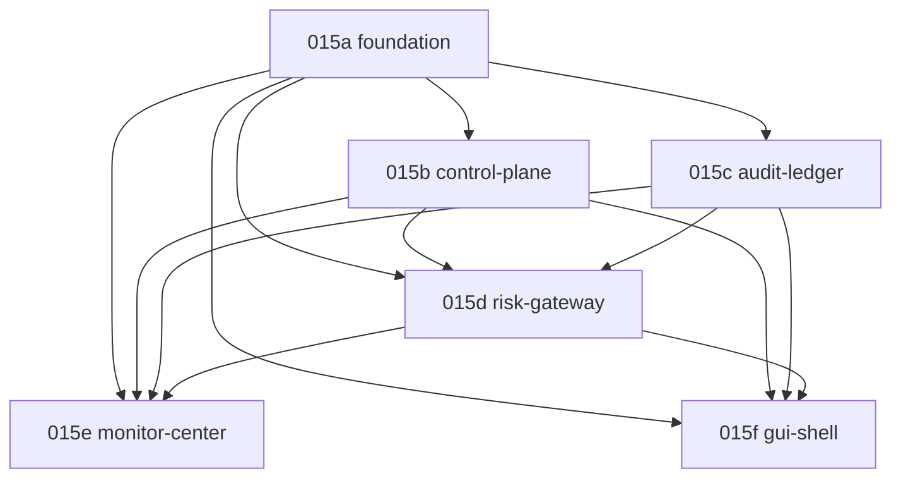

# 02 — V2 Scaffold Task Dependency Graph

This file is the canonical DAG over the 015X tasks. It is consumed by the
wave dispatcher together with `01_IMPLEMENTATION_WAVES.md`. All edges are
hard dependencies; soft "preferred" ordering is not encoded here.

## DAG (text form)

```
015a -> 015b
015a -> 015c
015a -> 015d
015b -> 015d
015c -> 015d
015a -> 015e
015b -> 015e
015c -> 015e
015d -> 015e
015a -> 015f
015b -> 015f
015c -> 015f
015d -> 015f
```

## DAG (mermaid)



## B2 remediation note

The earlier graph permitted a path where 015d became schedulable while
015c was still `blocked_approval`. The edges `015c -> 015d` and the
W3 `forbidden_until` rule in `01_IMPLEMENTATION_WAVES.md` jointly close
that path. Together they enforce: no risk-gateway scaffold without an
audit-ledger scaffold sink.

## Invariants

- DAG is acyclic. CI must reject any PR that introduces a cycle.
- Every node has `status ∈ {blocked_approval, approved, in_progress, merged, abandoned}`.
- `015a..015f.status == "blocked_approval"` while remediation gates are red.

## Verification

```
python -c "import json,glob; \
  edges=[('015a','015b'),('015a','015c'),('015a','015d'),('015b','015d'),('015c','015d'), \
         ('015a','015e'),('015b','015e'),('015c','015e'),('015d','015e'), \
         ('015a','015f'),('015b','015f'),('015c','015f'),('015d','015f')]; \
  ids=[json.load(open(p))['id'] for p in sorted(glob.glob('claude_worklog/v2_scaffold_queue/tasks/015*.json'))]; \
  assert set(ids)=={'015a','015b','015c','015d','015e','015f'}, ids; \
  print('DAG nodes ok:', ids); print('edges:', edges)"
```
