# Runtime Process and Deployment — Low-Level Reverse-Engineering Reference

- **Document status:** current-state reconstruction, not a deployment manifest
- **Observation window:** 2026-07-16 03:17–03:32 America/New_York
- **Source checkout observed:** `2dd584d632790c54c1054f7c4453cb9d36d0987c` (the checkout is changed by resident automation, so pin the hash again before acting)
- **Scope:** installed process topology, effective systemd configuration, process entrypoints, runtime dataflow, authority planes, restart/rollback limits, and deployment change impact
- **Safety:** no service, timer, Redis key, checkpoint, exchange connection, or runtime setting was changed while producing this document

This document deliberately separates three things that older documentation often conflates:

1. **Tracked source intent** — files committed in this repository.
2. **Effective deployment** — the unit fragment, drop-ins, working directory, command, environment, and resource controls that systemd actually applies.
3. **Business/runtime truth** — whether a loop is producing current, valid outputs, which cannot be inferred from `active (running)` alone.

The effective deployment is not currently reproducible from the repository. The installed user-unit tree, systemd-generated resource-control drop-ins, local environment files, mutable repository checkout, Redis state, generated frontend bundle, local model files, and externally configured tunnel are all required to reproduce what is running.

## 1. Executive runtime truth

- The machine is running a large, continuously mutating **paper/shadow system**, not a small static application. At the point-in-time recheck, 81 `ai-bot-v2` services were running, 35 `ai-bot-v2` timers were active, and 3 `ai-bot-v2` services were failed.
- The earlier operations trace in the same audit window observed 36 active timers and 58 installed unit/timer basenames with no tracked counterpart. The direct recheck observed 35 and 56 respectively. That drift during one audit is itself evidence that the installed topology is mutable and must be captured atomically before a restart or clone.
- The deployed backend is **Uvicorn with four workers on `127.0.0.1:8000`**. The deployed frontend is **Vite preview on `0.0.0.0:5173`**. Older statements that the backend is on 5173, uses one worker, or is absent are not current.
- Two trainer lanes run simultaneously: the persistent native CUDA trainer and the continuous offline GPU trainer. A separate all-timeframe publisher is also running even though the persistent trainer invokes the same publisher logic after a cycle.
- The current decision lane is provider ingestion -> native features -> native trainer/prediction publication -> orchestrator -> risk gateway -> paper trade management -> paper ledger/feedback -> portfolio and operator surfaces.
- No active unit named for the guarded trader runtime loop was observed. The current orchestrator, risk, and paper processes had `V2_RELEASE_MODE` unset; source therefore resolves the mode to `NON_LIVE` and disarms live submission (`v2/backend/app/services/live_gate/runtime_execution_state.py:43-46`, `:93-100`, `:232-239`).
- **Real order-submission code nevertheless exists.** `v2_trader_runtime_loop.run_once()` calls `evaluate_live_order_transport()` without a `dry_run` argument (`v2/backend/app/cli/v2_trader_runtime_loop.py:42-70`); that function defaults `dry_run=False` (`v2/backend/app/services/live_gate/binance_live_order_transport.py:1014-1024`) and calls a signed `WS order.place` transport after its gates clear (`:1446-1486`). Absence of an active submitter is not equivalent to absence of a submit path.
- Installed unit descriptions are comments, not enforcement. Enforcement must be verified in the effective command and source call path.

## 2. Inventory: installed versus tracked

### 2.1 Point-in-time counts

| Measurement | Earlier operations trace | Direct recheck | Interpretation |
|---|---:|---:|---|
| Running `ai-bot-v2*.service` instances | 81 | 81 | Includes six instantiated closed-loop workers. |
| Active `ai-bot-v2*.timer` units | 36 | 35 | Timer inventory changed during the audit window. |
| Failed `ai-bot-v2*.service` units | 3 | 3 | A timer can remain active while its invoked service is failed. |
| Installed unique `ai-bot-v2` unit basenames | not fixed in the earlier note | 156 | From the user manager's `list-unit-files`, not merely regular files in one directory. |
| Git-tracked `.service`/`.timer` paths | — | 125 | One tracked path per unique basename at this snapshot. |
| Installed basenames also found anywhere in Git | — | 100 | A name match does not prove content equality. |
| Installed basenames absent from all tracked unit artifacts | 58 | 56 | Direct evidence that Git alone cannot reconstruct the manager. |
| Unit paths in intended source-like directories | — | 10 | Eight under `tools/systemd_units/`, two under `v2/tools/systemd/`. |
| Unit paths under `claude_worklog/**` | — | 115 | These are primarily historical/evidence copies, not an authoritative installer. |

The 125 tracked paths must not be interpreted as a deployment definition. Most live under `claude_worklog/`, while the effective fragments live under `/home/wali/.config/systemd/user/`. Content can diverge even when the basename matches. A clone must compare hashes and effective merged properties, not only filenames.

### 2.2 Failed units at the observation point

| Unit | systemd result | Exit status | Known evidence |
|---|---|---:|---|
| `ai-bot-v2-autonomous-no-manual-next-task-policy.service` | `exit-code` | 1 | Failed; no journal entry was available through the inspected user journal. Root cause is not proven here. |
| `ai-bot-v2-orderbook-replay-rollover.service` | `exit-code` | 2 | Its `ExecStart` contains shell-style backslash escaping that systemd does not interpret as intended (`~/.config/systemd/user/ai-bot-v2-orderbook-replay-rollover.service:7`). `systemd-analyze verify` reports the escape problem. |
| `ai-bot-v2-trainer-scheduled-pretrain.service` | `exit-code` | 1 | Its unquoted spaced `PYTHONPATH` is invalid (`~/.config/systemd/user/ai-bot-v2-trainer-scheduled-pretrain.service:7`), but this audit does not claim that is the only failure cause. |

Do not “repair” the rollover command in isolation. The currently failed job would execute a destructive 100 GiB FIFO policy (`tools/orderbook_replay_rollover.py:2`, `:10-12`, `:46-83`), while the active 15-minute janitor implements five-day retention, a 300 GiB cap, and free-space pruning (`claude_worklog/tools/v2_disk_retention_janitor.py:31-36`, `:112-173`). At observation time, the replay tree was about 247 GiB. Making the failed unit runnable without first choosing one retention authority could delete roughly 147 GiB of replay evidence.

### 2.3 What “running” does and does not mean

`active (running)` proves that systemd still has a main process. It does not prove:

- that the last business cycle succeeded;
- that Redis reads or writes succeeded;
- that the newest payload is fresh;
- that a trainer performed an optimizer step;
- that a publisher wrote every expected output;
- that temporal/data-quality gates passed;
- that downstream loops consumed the same cycle;
- or that the loop is not swallowing child failures.

The clearest concrete example is `tools/continuous_offline_gpu_trainer_loop.sh:56-76`: the infinite shell loop executes the batch trainer, converts a non-zero trainer exit into an informational `echo`, and continues. systemd therefore sees a live shell even when an individual training run fails.

## 3. Effective process graph

### 3.1 Core flow and cadences

```mermaid
flowchart LR
    X[External public/private provider APIs and streams] --> I[Ingestor and provider service fleet]
    I --> R[(Redis v2:* market/provider plane)]
    R --> F[Native feature pipeline\n60 s]
    F --> FS[(features:latest and immutable snapshot keys\nplus latest snapshot file)]
    FS --> T[Persistent native CUDA trainer\nresident; unit arg 5 s]
    R --> T
    T --> C[(Native checkpoint/model and prediction state)]
    R --> O[Continuous offline GPU trainer\nnon-live candidate lane]
    C --> P[All-timeframe prediction/signal publisher\n60 s]
    T -. invokes the same publisher logic .-> P
    P --> PS[(prediction and paper-signal keys\noperator/public artifacts)]
    PS --> A[Orchestrator arbitration\n60 s]
    A --> AD[(orchestrator proposals/decisions\npaper signals)]
    AD --> G[Risk gateway controller\n30 s]
    G --> RD[(per-ID and latest risk decisions)]
    AD --> M[Paper trade-management loop\n60 s]
    RD --> M
    M --> L[(paper ledger, fills, outcomes, trainer feedback)]
    L --> V[Portfolio state publisher\n30 s]
    L --> T
    P --> B[FastAPI backend\n4 workers, loopback:8000]
    V --> B
    B --> W[Vite preview frontend\n0.0.0.0:5173]
    W --> CF[cloudflared tunnel\nexternal routing stored outside repo]
```



The arrows describe expected data dependencies, not atomic transactions. These are independent polling loops. The unit-level `After=` declarations provide only startup ordering; they do not guarantee health, freshness, same-cycle lineage, or restart propagation.

### 3.2 Low-level core service map

| Stage | Effective active unit and command | Inputs | Writes/side effects | Timing and coupling |
|---|---|---|---|---|
| Market/provider acquisition | Many units; examples include Binance kline WSS, aggregate trades, CoinAPI, KuCoin, CoinGlass, Moralis, Santiment, LunarCrush, Nansen, liquidation and microstructure loops | External provider streams/APIs and existing V2 state | Provider-specific `v2:*` market, orderbook, derivatives, alternative-data, status and heartbeat keys; some runtime files | Independently restarted. Two CoinAnk units execute copied legacy-owned scripts directly, not a native wrapper: installed unit lines `:8-15` in `ai-bot-v2-coinank-global-aggregator-direct.service` and `ai-bot-v2-coinank-live-direct.service`. |
| Feature assembly | `ai-bot-v2-feature-pipeline-native-loop.service`; `python -m v2.backend.app.cli.v2_feature_pipeline_native_loop --loop --interval-seconds 60` (`~/.config/systemd/user/...:10-17`) | Closed OHLCV, prices, books, open interest, long/short, liquidations, TA and provider/context keys | `v2:features:latest:{symbol}:{timeframe}`, `v2:features:snapshot:{snapshot_id}`, `v2:features:snapshots`, heartbeat and `v2/runtime/v2_feature_pipeline_native/latest/latest_feature_snapshot.json` (`v2/backend/app/cli/v2_feature_pipeline_native_loop.py:386-387`, `:443-446`, `:1496`, `:1653-1658`, `:1731-1737`) | `After=native-ingestors` is ordering only. Feature/data temporal correctness is covered in the temporal-lineage component document. |
| Persistent native trainer | `ai-bot-v2-native-cuda-trainer-persistent.service`; native persistent CLI, unit interval 5 s, max 16,384 rows (`~/.config/systemd/user/...:7-19`) | Feature snapshots, trusted replay/feedback, paper ledger and portfolio, current model | `.local_models/v2_native_rl_masa_ppo`, persistent state, trainer/operator artifacts, predictions, guard keys (`v2/backend/app/services/native_trainer/persistent_cuda_trainer_runtime.py:82-94`, `:111-136`) | `run_one_persistent_cycle()` trains, refreshes all-timeframe outputs, updates checkpoint retention, and publishes drawdown guards (`:3732-3845`). If no blockers, its loop can run with only the configured post-training pause (`:3848-3904`). |
| Offline GPU trainer | `ai-bot-v2-continuous-offline-gpu-trainer.service`; `tools/continuous_offline_gpu_trainer_loop.sh` (`~/.config/systemd/user/...:8-45`) | Current checkpoint read-only warm start and cached trusted replay | Offline-only model candidate/report/cache paths according to the wrapper; it does not itself promote (`tools/continuous_offline_gpu_trainer_loop.sh:4-18`, `:48-76`) | Runs concurrently with the persistent trainer. The wrapper defaults to 12 epochs, 60 steps/epoch, batch 2,048, 49,152-row limit and a 90-second outer interval (`:36-47`). Non-zero child exits are swallowed. |
| Prediction/signal publication | `ai-bot-v2-all-timeframe-prediction-signal-price-target-publisher.service`; 60-second loop (`~/.config/systemd/user/...:8-13`) | Native predictions, exact/latest features, market state, paper lineage | Per-timeframe prediction keys, paper signal keys, public/operator artifacts | The standalone CLI calls `build_packet()` and `write_outputs()` every cycle (`v2/backend/app/cli/v2_all_timeframe_prediction_signal_price_target_publisher.py:82-115`). The persistent trainer separately calls the same functions after training (`persistent_cuda_trainer_runtime.py:2533-2558`, `:3816`). These are concurrent writers unless protected inside the publisher. |
| Orchestration | `ai-bot-v2-orchestrator-arbitration-loop.service`; 60-second loop (`~/.config/systemd/user/...:9-16`) | `v2:prediction:*`, exact feature context and signal/gate inputs | `v2:orchestrator:proposals`, `v2:orchestrator:decisions`, `v2:signals:paper`, heartbeat (`v2/backend/app/cli/v2_orchestrator_arbitration_loop.py:120-171`, `:735-743`, `:809-864`) | Declares `After=rl-core-inference-loop`, not a health requirement (`~/.config/systemd/user/...:5`). |
| Risk evaluation | `ai-bot-v2-risk-gateway-live-loop.service`; 30-second controller loop (`~/.config/systemd/user/...:7-15`) | Orchestrator decisions, trust/risk profile/runtime execution state | `v2:decision:risk:{id}`, candidate/signal indexes, `v2:risk:gateway:decisions`, `:latest`, active profile and heartbeat (`v2/backend/app/cli/v2_risk_gateway_live_loop.py:518-563`, `:571-655`) | Its description says controller/no trader. That statement applies to this unit, not to all source in the repository. |
| Paper execution/accounting | `ai-bot-v2-trade-management-paper-loop.service`; 60-second loop (`~/.config/systemd/user/...:7-20`) | Signals/orchestrator decisions, risk records, market evidence, existing paper state | `v2:paper:accepted_fills`, quarantine, ledger, closed trades, outcome labels, trainer feedback and heartbeat (`v2/backend/app/cli/v2_trade_management_paper_loop.py:32495-32572`, `:33220`) | Code declares `v2:paper:ledger` the paper accounting source of truth and preserves accepted-fill economics (`:10621-10655`). Infrastructure durability limits that claim; see section 6. |
| Portfolio | `ai-bot-v2-portfolio-state-publisher.service`; 30-second loop (`~/.config/systemd/user/...:8-13`) | Paper accepted-fill state/ledger, current price and features | `v2:portfolio:state` with 900-second TTL and public/operator payloads (`v2/backend/app/cli/v2_portfolio_state_publisher.py:25-38`, `:287-300`, `:1049-1050`) | Current unit has `WorkingDirectory=/home/wali` but imports `v2.backend...`; it relies on its quoted repo `PYTHONPATH`. |
| API | `ai-bot-v2-public-website-backend.service` effective four-worker Uvicorn command | Redis and generated runtime/public files through route modules | HTTP responses; individual route implementations may also write V2-owned state | Effective drop-in chain is detailed in section 4. Four workers mean process-local caches, locks and globals are not shared. |
| Web UI | `ai-bot-v2-frontend-vite.service`; `npm run preview -- --host 0.0.0.0 --port 5173` | Prebuilt `v2/frontend/dist` and backend APIs | Browser/static responses | `ExecStartPre` checks only that `dist/index.html` is non-empty; it does not prove the bundle matches the checkout (`~/.config/systemd/user/...:8-14`). Build is `tsc -b && vite build && prune` (`v2/frontend/package.json:6-10`). |

### 3.3 Concurrent trainers and publishers: practical consequences

The deployment does not have one trainer and one publisher:

- The persistent trainer reads/writes the current native model lane and continuously publishes operational state.
- The offline trainer warm-starts from the current checkpoint and writes an offline candidate lane. Its comment says promotion is delegated to scheduled out-of-sample/H2L processing, but `ai-bot-v2-trainer-scheduled-pretrain.service` was failed at observation time.
- Both trainers compete for host/GPU/CPU/storage resources. Only the persistent trainer had systemd-generated controls: `CPUQuota=1600%`, `MemoryHigh=72 GiB`, `MemoryMax=75 GiB` under `/home/wali/.config/systemd/user.control/ai-bot-v2-native-cuda-trainer-persistent.service.d/50-*.conf:4`. No GPU isolation is expressed by systemd.
- The all-timeframe publisher runs as a standalone service and is invoked from the persistent trainer. Any change to `build_packet()` or `write_outputs()` therefore affects at least two active call sites and can create last-writer-wins behavior.
- Trainer “active” does not mean learning. Required truth includes accepted input count, rejected-reason counts, optimizer steps, checkpoint hash before/after, promotion result, reload verification, and prediction lineage.

## 4. Backend and frontend effective deployment

### 4.1 Backend drop-in precedence

Systemd merges the base fragment and drop-ins in lexical order. Blank `ExecStart=` assignments reset the prior command. The installed chain is:

| Layer | Working directory effect | Command effect |
|---|---|---|
| Base `~/.config/systemd/user/ai-bot-v2-public-website-backend.service:7-19` | Mutable repo `v2/backend` | Shell wrapper `v2/backend/scripts/start_v2_backend_uvicorn.sh`; wrapper defaults to loopback port 8000 and one worker (`v2/backend/scripts/start_v2_backend_uvicorn.sh:17-45`). |
| `50-release-current.conf:2-5` | Changes cwd to `/home/wali/releases/nervyx-one/current/v2/backend` | Resets to direct Uvicorn on 5173, one worker. |
| `60-auth-state.conf:1-2` | No cwd change | Adds a backend auth `EnvironmentFile`; values are intentionally not reproduced here. |
| `70-closeout-shutdown.conf:4-11` | No cwd change | Resets Uvicorn to 8000, one worker, ten-second graceful-shutdown setting. |
| `80-live-operator-runtime-static-dir.conf` | No cwd change | Adds runtime/static-directory environment configuration; values are deployment state, not source authority. |
| `90-codex-repo-runtime.conf:1-2` | Overrides release cwd back to the mutable repository | No command reset. |
| `95-codex-enterprise-public-capacity.conf:10-11` | Retains mutable repo cwd | Final reset: loopback 8000, four workers, keep-alive one second. |

The effective result confirmed by `systemctl show`, `ss`, and the process table is:

```text
cwd:      /home/wali/Desktop/AI BOT REBUILD/v2/backend
command:  ... python3 -m uvicorn app.main:create_app --factory
bind:     127.0.0.1:8000
workers:  4
```

Five Python processes shared the listening socket at observation time: one Uvicorn parent and four workers. Changing an in-memory cache, singleton, rate limiter, lock, shutdown registry, or background-task registry must be evaluated under multiprocess semantics. A source-level unit test in one process is insufficient evidence for worker coordination.

The release symlink exists in an earlier drop-in but is not the effective working directory. A source checkout edit can therefore affect the next worker/service restart without a release build or artifact promotion.

### 4.2 Frontend

The frontend has no observed drop-ins. Its installed unit is authoritative for the process:

- cwd: `/home/wali/Desktop/AI BOT REBUILD/v2/frontend` (`~/.config/systemd/user/ai-bot-v2-frontend-vite.service:8`);
- precondition: `test -s dist/index.html` (`:11`);
- command: `npm run preview -- --host 0.0.0.0 --port 5173` (`:12`);
- restart policy: always, five seconds (`:13-14`);
- observed listener: `0.0.0.0:5173`.

The Vite process serves the existing bundle. Editing `src/` does not update `dist/`; restarting does not build; and the precondition does not compare source, lockfile, build metadata or content hash. Reproduction therefore requires a pinned Node version, dependency lock, exact build command, generated bundle hash, and deployment of that bundle.

### 4.3 Tunnel/public edge

`cloudflared.service` is an active **system** service, not an `ai-bot-v2` user service. Its fragment is `/etc/systemd/system/cloudflared.service`; the file was mode `0644 root:root`. The installed `ExecStart` at line 9 contains credential material directly in the command line. The credential is intentionally not reproduced.

Consequences:

- credential material is readable from the world-readable unit and process arguments; rotate it and move it to a protected credential mechanism before treating the deployment as secure;
- no local `/home/wali/.cloudflared` directory and no `/etc/cloudflared` config file were found, so hostname/ingress routing appears to depend on remote Cloudflare-side state;
- the public edge cannot be rebuilt from this repository or host files alone;
- changing frontend/backend binds or ports can silently break remote routing even when local health checks pass.

## 5. Python entrypoints and module-identity drift

The same backend source tree is imported under incompatible package roots.

| Runtime family | Effective form | Source evidence | Risk |
|---|---|---|---|
| FastAPI backend | cwd `v2/backend`; `uvicorn app.main:create_app` | `v2/backend/app/main.py:26-64` imports `app.*`; the wrapper uses `app.main:create_app` at `v2/backend/scripts/start_v2_backend_uvicorn.sh:37-45` | Production API module identity is `app.*`. |
| Most repo-root loops | `python -m v2.backend.app.cli.<name>` | Feature, orchestrator, risk, paper and trainer units use this form; their imports are `v2.backend.app.*` | Tests and loops can load the same physical file under the longer name. |
| Self-healing supervisor | repo-root cwd; `python -m app.cli.v2_self_healing_supervisor` | Installed unit `:8-14`; source imports `app.services...` at `v2/backend/app/cli/v2_self_healing_supervisor.py:23` | Relies on `PYTHONPATH` including `v2/backend`; differs from neighboring loops. |
| Legacy-owned direct scripts | absolute `.py` paths under `v2/legacy_owned_runtime` | CoinAnk direct units, installed lines cited in section 3 | Script directory, cwd and inserted paths can shadow native modules. |
| Automation/control plane | absolute scripts under `claude_worklog/tools` | Agent supervisor, schedulers and closed-loop units | These processes can write the worktree and dispatch agents; they are deployment actors, not passive monitors. |

If one process imports a physical module as both `app.x` and `v2.backend.app.x`, Python creates separate module objects. Module-level locks, caches, registries, shutdown flags, class identity and `isinstance()` behavior can diverge. Any low-level change must search both namespaces and validate the effective cwd/PYTHONPATH of every caller.

The import environment is already defective in eight installed units. Unquoted `Environment=PYTHONPATH=/home/wali/Desktop/AI BOT REBUILD...` is split at spaces; systemd ignores trailing assignments. Active examples were observed with effective `PYTHONPATH=/home/wali/Desktop/AI`, not the repository. Affected files are:

```text
ai-bot-v2-autonomous-mission-execution-burndown.service:8
ai-bot-v2-cascade-context-publisher.service:8
ai-bot-v2-continuous-offline-gpu-trainer.service:19
ai-bot-v2-native-cuda-trainer-persistent.service:16
ai-bot-v2-native-ppo-masa-continuous-training-guard.service:9
ai-bot-v2-portfolio-cascade-guard.service:8
ai-bot-v2-report-center-indexer.service:11
ai-bot-v2-trainer-scheduled-pretrain.service:7
```

Some commands survive because their cwd and `python -m v2...` make the repository importable through the empty/current-directory entry in `sys.path`. That accidental success is not reproducibility.

## 6. Runtime authority and truth planes

| Plane | What it is authoritative for | What it is not authoritative for | Current weakness |
|---|---|---|---|
| External exchange/provider | Market/account response delivered by that source at that source's timestamps | Whether local processing was timely, complete or accepted | Provider clocks, receipt times and local availability must remain distinct. |
| Effective systemd manager | Which fragment/drop-ins are loaded, command/cwd/resource limits, current PID/result/restart count | Business health or source intent | Installed tree is only partially tracked and changes independently of Git. |
| Git checkout | Exact tracked source at a commit | Effective unit tree, env, models, Redis, bundle or remote tunnel config | Active services and automation execute the mutable working tree directly. |
| Redis `v2:*` | Current transient coordination/state as seen by a reader at that instant | Durable accounting, complete history, or proof of PIT correctness | At observation: about 1,112,340 keys, 31.19 GiB used of 32 GiB, `allkeys-lru`, AOF disabled, snapshot-only persistence, and about 9.9 million changes since the last save. Keys can be evicted or lost. |
| Paper ledger keys/files | Component-declared accepted-fill and feedback state | Infrastructure-grade durable ledger | The paper loop calls `v2:paper:ledger` its accounting source of truth (`v2_trade_management_paper_loop.py:10621-10627`), but Redis eviction/no-AOF means it cannot be the sole durable authority. |
| Runtime JSON/JSONL/model files | Evidence written by a particular producer and path | Freshness, uniqueness, writer identity, or cross-file atomicity unless explicitly enforced | Many independent writers and retention jobs; public files are generated inside the served tree. |
| FastAPI responses | What a specific worker assembled for a request | Raw data-plane truth or agreement among four workers | Process-local state can differ; route comments and status labels can be stale. |
| Frontend bundle | UI code actually served by Vite | Current `src/` or backend contract | Build is not part of service startup; `dist` can lag source. |
| Documentation/worklogs | Audit evidence and intended policy | Runtime enforcement | Historical reports conflict and resident automation rewrites worklog state. |

Redis configuration has a direct architectural implication: TTLs and `allkeys-lru` are part of correctness, not just capacity tuning. A missing orchestrator decision, risk record, paper row, model guard or heartbeat may mean “not produced,” “expired,” “evicted,” “lost after restart,” or “read under the wrong key schema.” Consumers must preserve those distinctions.

## 7. Systemd defects and failure masking

### 7.1 Verified syntax/semantic defects

`systemd-analyze --user verify` reported:

- invalid unquoted `PYTHONPATH` assignments in the eight units listed in section 5;
- shell-style `\ ` escapes ignored inside several systemd command strings, including the base backend, orderbook rollover, shadow outcome metrics and live-canary dry-run units;
- `StartLimitIntervalSec` placed in `[Service]` and ignored in `ai-bot-v2-out-of-sample-evidence-producer.service:14`;
- multiple invalid fragments that systemd partially accepts by ignoring tokens rather than refusing to load the entire unit.

This is dangerous because a loaded unit may look valid while one directive is silently ignored. The only authoritative review is the combination of `systemd-analyze verify`, `systemctl --user cat`, `systemctl --user show`, `/proc/<pid>/environ` for a narrowly filtered variable, and observed sockets/processes.

### 7.2 Restart policies can conceal instability

- Many core loops use `Restart=always` with 5–15 second delays. A status snapshot can catch a process between repeated crashes unless `NRestarts`, `Result`, start timestamp and recent logs are checked.
- One-shot timers generally remain active after a failed invocation and will try again. “Timer active” does not mean “last service succeeded.”
- Thirty-one installed timer files set `Persistent=true`; missed jobs can run after the user manager returns. This matters for destructive retention, automated task execution, trainer promotion and generated evidence.
- Shell wrappers can swallow errors, as the offline trainer does.
- Several service commands redirect stdout/stderr to files inside `claude_worklog` rather than journald. `journalctl` alone is incomplete.
- `After=` only orders startup. It does not require the named unit to be healthy, does not wait for current Redis payloads, and does not restart downstream consumers after an upstream restart.

### 7.3 Destructive retention has two authorities

The active janitor unit runs every 15 minutes and is persistent (`~/.config/systemd/user/ai-bot-v2-disk-retention-janitor.timer:5-7`). Its source can delete old replay directories, prune to a 300 GiB total, prune to restore free-space thresholds, tail-cap JSONL, truncate held-open logs, and delete old `/tmp/holdout_tail_*` files (`v2_disk_retention_janitor.py:112-255`).

The failed rollover timer is also persistent and is intended to invoke a second deletion policy every six hours (`~/.config/systemd/user/ai-bot-v2-orderbook-replay-rollover.timer:6-9`). Its target is currently broken, which is safer than silently activating the conflicting 100 GiB policy. Choose, test and version one retention authority before changing either unit.

## 8. Automation is part of the deployment

The following active families can generate tasks, write repository files, dispatch Claude/Codex processes, and/or commit selected outputs:

- `ai-bot-v2-agent-supervisor.service`;
- `ai-bot-v2-parallel-scheduler.service`;
- `ai-bot-v2-parallel-spark-automation.service`;
- six `ai-bot-v2-closed-loop-{claude,codex}-worker@{1,2,3}.service` instances;
- worker-pool and closed-loop executor timers;
- `ai-bot-v2-worker-porting-orchestrator.service`;
- Codex watchdog/review/task-runner units;
- autonomous backlog/burndown/self-healing/governor units.

The agent supervisor explicitly materializes files (`claude_worklog/tools/agent_supervisor.py:1038-1052`), starts subprocesses (`:758-824`), stages eligible materialized files, and runs `git commit` when a task has `auto_commit=true` and an allowed risk level (`:2288-2348`). Therefore:

- HEAD and working-tree state may change while long-running services continue executing old imported code;
- a restart can switch a service from old in-memory code to a newer, possibly unreviewed checkout;
- a `git checkout` alone is not a stable deployment operation while automation remains active;
- source-audit snapshots must record start/end HEAD and dirty status;
- controlled deployment or rollback requires an explicit automation-quiescence boundary.

Do not stop or alter these processes merely to inspect the system. Quiescing them is an operational mutation requiring an approved maintenance plan because they are part of current control-plane behavior.

## 9. Startup, restart and rollback limits

### 9.1 Startup is not transactional

Core units declare a sparse partial order:

- features are ordered after native ingestors;
- orchestrator is ordered after RL-core inference;
- risk and paper are ordered after orchestrator;
- backend is ordered after paper;
- frontend is ordered after backend.

Most edges are `After=` and sometimes `Wants=`, not `Requires=` plus a readiness protocol. Redis payloads survive process restarts and can outlive their producer. Starting in nominal order can still consume stale state. A safe startup proof must validate producer heartbeat, payload freshness, schema, lineage and temporal cutoffs at each edge before treating the next stage as ready.

### 9.2 Restart boundaries

Before restarting one component, determine all of the following:

1. Which exact fragment and drop-ins systemd will load after `daemon-reload`.
2. Which source commit and dirty files the new process will import.
3. Which Python namespace and cwd it will use.
4. Which existing Redis keys/runtime files it will read as warm state.
5. Which keys/files it will overwrite and their TTLs.
6. Whether another active process writes the same artifact.
7. Whether a persistent timer or self-healer can independently restart/reinvoke it.
8. Whether stopping it interrupts an atomic file replace, checkpoint write, ledger cycle or retention pass.
9. Whether downstream processes must be restarted, drained, or merely allowed to observe a new heartbeat.
10. Whether the code can reach exchange mutation if a release/env/state gate changes.

`systemctl restart` is not a code-only action here. It can change source version, package resolution, module identity, worker count, environment, cached state and write ownership at once.

### 9.3 Why `git revert` is not a complete rollback

A rollback must address all changed planes:

| Plane | Rollback item |
|---|---|
| Source | Pinned commit plus explicit treatment of dirty/generated files. |
| Python/Node dependencies | Exact lockfiles, interpreter/runtime versions, native/CUDA dependencies and installed environment. |
| systemd | Base fragments, every user drop-in, generated `user.control` resource drop-in, enabled symlinks, timer state and manager reload. |
| Environment/secrets | Environment-file schema and protected secret references; never copy values into docs or process arguments. |
| Redis | Key-schema compatibility, TTL/eviction consequences, migration/backfill and a tested restore point. Do not blindly restore stale decisions. |
| Trainer | Model architecture, checkpoint/manifest pair, promotion state, offline candidate lane and optimizer compatibility. |
| Paper accounting | Accepted-fill/ledger/outcome state and immutable identity rules. Runtime economic history normally must move forward, not be reverted with code. |
| Frontend | Built `dist` artifact and its content hash, not only `src`. |
| Edge | Tunnel credential and remote hostname/ingress configuration. |
| Evidence/retention | Replay archives, JSONL/status files, retention policy and any deletions already performed. Deleted evidence cannot be recovered by Git. |

Rollback should normally preserve append-only/runtime economic evidence and deploy compatible readers, rather than rewinding evidence to match code. Any rollback across a Redis or file-contract change needs a forward/ backward-compatible migration plan.

## 10. Rebuild/copy requirements

A faithful copy of the observed system requires these artifacts in addition to repository source:

1. An atomic export of `systemctl --user list-unit-files`, effective `systemctl --user cat` output, enabled links, user-manager version, linger/login behavior, and `/home/wali/.config/systemd/user.control`.
2. Hashes of installed units compared with tracked candidates; choose a canonical tracked deployment directory and installer.
3. A manifest of working directories, Python module names, interpreter paths and narrowly defined environment keys for every unit.
4. Python and Node dependency locks, OS packages, CUDA/driver/runtime versions, and hardware/resource assumptions.
5. Redis configuration, schema/key registry, TTLs, stream semantics, persistence/restore procedure, memory sizing and a scrubbed representative dataset.
6. Runtime directory schemas and ownership for `v2/runtime`, `v2/frontend/public/operator_runtime`, `claude_worklog`, `.local_models`, logs and caches.
7. Checkpoint manifests/weights and a cryptographic integrity map, with a documented compatible architecture.
8. Frontend build inputs and output hash, including the prune step.
9. Protected credential references and rotation/bootstrap procedures; never package raw secret values.
10. Cloudflare tunnel hostname/ingress state or a replacement edge manifest.
11. Startup/readiness probes for each graph edge and an end-to-end paper lineage fixture.
12. One reconciled retention policy and tested dry-run/deletion accounting.
13. An automation bootstrap and quiescence protocol so the copy does not mutate itself before its baseline is recorded.

Until those items are versioned and tested, “clone repo and start services” does not reproduce this host.

## 11. Change-impact checklist

Use this checklist for every source, config, unit or operational change—even a one-line helper edit.

### 11.1 Universal questions

- **Symbol callers:** Which functions/classes call the changed symbol? Use the generated Python/TypeScript call atlases and verify unresolved dynamic calls manually.
- **Process owners:** Which active service, one-shot, timer, API worker, automation runner or direct script imports/executes it?
- **Namespace:** Is the file imported as `app.*`, `v2.backend.app.*`, an absolute script, or more than one?
- **Deployment:** Which base unit, drop-in, cwd, interpreter, env file and resource control apply?
- **Concurrency:** How many workers/processes can execute it, and do they share Redis/files without a transaction or lock?
- **Inputs:** List Redis keys/patterns, files, provider calls, env keys and CLI arguments. Preserve event, ingestion, availability, generation, cutoff, decision and execution times as distinct fields.
- **Outputs:** List keys/files/routes/checkpoints/logs, TTLs, atomicity, ownership and all other writers.
- **Downstream:** Trace every consumer through features, trainer, publisher, orchestrator, risk, paper, portfolio, API, frontend and training feedback.
- **Failure behavior:** Does error handling fail closed, return stale state, swallow an exception, keep the service active, or trigger restart/self-healing?
- **Live reachability:** Can the change alter release mode, live-gate state, accepted symbols, risk profile, transport enablement, credentials, order candidate construction or `dry_run`? If yes, operator approval is required before editing or restarting that path.
- **Temporal safety:** Can it admit unfinished candles, future availability, stale features, invalid lineage, or MASA cutoff after PPO decision time?
- **State compatibility:** Can old Redis/file/checkpoint payloads be read by the new code and vice versa?
- **Tests:** Unit tests for the changed logic; contract tests for keys/files; multiprocess tests for API worker state; integration tests for graph edges; explicit negative/fail-closed cases.
- **Deploy/rollback:** Exact artifact hash, restart set, validation gates and multi-plane rollback procedure.

### 11.2 High-value impact chains

| If this changes | Minimum impact scope to inspect |
|---|---|
| Provider key/schema/timestamp | Provider loop -> feature merge -> tensor/trainer -> prediction trust -> orchestrator -> risk -> paper -> public surfaces. |
| Feature field/order/missingness | Feature spec and snapshot IDs -> 4x tensor channels -> checkpoint input dimension/architecture -> replay cache -> trainer/publisher parity -> every decision consumer. |
| Trainer/model/checkpoint | Both trainer lanes -> checkpoint manager/promotion -> resident reload -> publisher (two call sites) -> signal calibration -> paper feedback and UI. |
| Publisher packet/key | Standalone publisher and persistent-trainer invocation -> prediction/signal Redis keys -> orchestrator scans -> paper/risk lineage -> API/UI artifacts. |
| Orchestrator decision | Risk input and indexes -> paper admission -> lineage views -> portfolio/training outcomes. |
| Risk decision or TTL | Per-ID records/indexes/latest payload -> paper dereference/fallback behavior -> audit lineage -> live transport gates. |
| Paper fill/ledger helper | Accepted-fill immutability -> open/closed positions -> portfolio/equity -> outcome labels -> trusted replay -> future model behavior. |
| Backend route/middleware/global | Four worker processes -> auth/session/cache/lock semantics -> frontend and tunnel clients -> graceful shutdown. |
| Frontend source/build | TypeScript contracts -> generated `dist` -> Vite preview -> browser cache/public edge; restarting alone is insufficient. |
| Unit/drop-in/PYTHONPATH | Package identity -> imported code -> worker/cadence/resource semantics -> all read/write ownership and restart ordering. |
| Redis memory/persistence/TTL | Every transient authority; explicitly test missing/evicted/restarted states and never translate them silently into valid business data. |
| Retention | Replay/training coverage, holdout evidence, logs, incident reconstruction and disk availability. |
| Automation task policy | Worktree writes, agent subprocesses, commits, HEAD changes and which code a later restart loads. |

## 12. Current active service inventory (81)

This is the point-in-time running list, including instantiated templates:

```text
ai-bot-v2-a-plus-context-loop.service
ai-bot-v2-adaptive-capital-productivity.service
ai-bot-v2-adaptive-gate-tuner.service
ai-bot-v2-agent-supervisor.service
ai-bot-v2-agg-trades-ingestor-loop.service
ai-bot-v2-aicoin-whale-intel-loop.service
ai-bot-v2-all-timeframe-prediction-signal-price-target-publisher.service
ai-bot-v2-alt-data-candidate-publisher-loop.service
ai-bot-v2-alt-data-symbol-scoring-loop.service
ai-bot-v2-altdata-confluence-loop.service
ai-bot-v2-alternative-data-status-loop.service
ai-bot-v2-arkham-presence-loop.service
ai-bot-v2-binance-kline-wss-loop.service
ai-bot-v2-cascade-context-publisher.service
ai-bot-v2-closed-loop-claude-worker@1.service
ai-bot-v2-closed-loop-claude-worker@2.service
ai-bot-v2-closed-loop-claude-worker@3.service
ai-bot-v2-closed-loop-codex-worker@1.service
ai-bot-v2-closed-loop-codex-worker@2.service
ai-bot-v2-closed-loop-codex-worker@3.service
ai-bot-v2-codex-shutdown-readiness-takeover.service
ai-bot-v2-codex-watchdog.service
ai-bot-v2-coinank-direct-status-publisher.service
ai-bot-v2-coinank-global-aggregator-direct.service
ai-bot-v2-coinank-intel-bridge.service
ai-bot-v2-coinank-live-direct.service
ai-bot-v2-coinapi-rest-fallback-loop.service
ai-bot-v2-coinapi-wsds-loop.service
ai-bot-v2-coinglass-provider-loop.service
ai-bot-v2-continuous-edge-guardian.service
ai-bot-v2-continuous-offline-gpu-trainer.service
ai-bot-v2-crossexchange-analyzer.service
ai-bot-v2-dynamic-symbol-discovery-loop.service
ai-bot-v2-edge-replay-factory.service
ai-bot-v2-feature-pipeline-native-loop.service
ai-bot-v2-feature-snapshot-builder.service
ai-bot-v2-frontend-vite.service
ai-bot-v2-full-talib-ta-loop.service
ai-bot-v2-ingestors-status-publisher.service
ai-bot-v2-kucoin-public-rest-loop.service
ai-bot-v2-liquidation-enhanced.service
ai-bot-v2-liquidation-levels-engine.service
ai-bot-v2-liquidation-runtime-status-publisher.service
ai-bot-v2-liquidation-wss-paper-shadow.service
ai-bot-v2-log-errors-status-publisher.service
ai-bot-v2-lunarcrush-altdata-loop.service
ai-bot-v2-market-chart-payload-publisher.service
ai-bot-v2-memory-watchdog.service
ai-bot-v2-microstructure-feed-quality-monitor.service
ai-bot-v2-microstructure-runtime-supervisor.service
ai-bot-v2-moralis-provider-loop.service
ai-bot-v2-nansen-altdata-loop.service
ai-bot-v2-native-cuda-trainer-persistent.service
ai-bot-v2-native-ingestors-live-loop.service
ai-bot-v2-operator-review-publisher.service
ai-bot-v2-opportunity-tracker-publisher.service
ai-bot-v2-orchestrator-arbitration-loop.service
ai-bot-v2-out-of-sample-evidence-producer.service
ai-bot-v2-paper-decision-lineage-publisher.service
ai-bot-v2-paper-shadow-observation.service
ai-bot-v2-parallel-scheduler.service
ai-bot-v2-parallel-spark-automation.service
ai-bot-v2-portfolio-cascade-guard.service
ai-bot-v2-portfolio-state-publisher.service
ai-bot-v2-position-history-persistent-tracker.service
ai-bot-v2-production-replacement-runtime-guard.service
ai-bot-v2-professional-market-chart-payload-publisher.service
ai-bot-v2-provider-data-plane-health.service
ai-bot-v2-public-intel-free-tier-loop.service
ai-bot-v2-public-website-backend.service
ai-bot-v2-readonly-decision-observatory.service
ai-bot-v2-risk-gateway-live-loop.service
ai-bot-v2-rl-core-inference-loop.service
ai-bot-v2-santiment-pro-ingestor.service
ai-bot-v2-self-healing-supervisor.service
ai-bot-v2-strategy-supply-publisher.service
ai-bot-v2-symbol-universe-publisher.service
ai-bot-v2-technical-analysis-status-publisher.service
ai-bot-v2-trade-management-paper-loop.service
ai-bot-v2-trainer-checkpoint-evidence.service
ai-bot-v2-worker-porting-orchestrator.service
```

## 13. Current active timer inventory (35)

```text
ai-bot-v2-automation-liveness-watchdog.timer
ai-bot-v2-autonomous-full-rebuild-self-healing-controller.timer
ai-bot-v2-autonomous-mission-backlog.timer
ai-bot-v2-autonomous-mission-execution-burndown.timer
ai-bot-v2-autonomous-no-manual-next-task-policy.timer
ai-bot-v2-champion-challenger-publisher.timer
ai-bot-v2-claude-task-runner.timer
ai-bot-v2-closed-loop-executor.timer
ai-bot-v2-closed-loop-worker-pool.timer
ai-bot-v2-codex-review-runner.timer
ai-bot-v2-codex-shutdown-readiness-takeover.timer
ai-bot-v2-copied-runtime-burn-in.timer
ai-bot-v2-derivatives-runtime-publisher.timer
ai-bot-v2-disk-retention-janitor.timer
ai-bot-v2-dynamic-93-burn-in-edge-website-sync.timer
ai-bot-v2-dynamic-93-edge-recovery-signal-quality-burndown.timer
ai-bot-v2-executive-command-center.timer
ai-bot-v2-final-operator-decision-event-watcher.timer
ai-bot-v2-live-canary-dry-run.timer
ai-bot-v2-market-state-integrity-monitor.timer
ai-bot-v2-native-ppo-masa-continuous-training-guard.timer
ai-bot-v2-no-status-change-sla-watchdog.timer
ai-bot-v2-orderbook-replay-rollover.timer
ai-bot-v2-paper-equity-reconciliation-loop.timer
ai-bot-v2-paper-shadow-outcome-observer.timer
ai-bot-v2-pending-task-watchdog.timer
ai-bot-v2-post-hoc-replay-outcome-miner.timer
ai-bot-v2-production-replacement-runtime-governor.timer
ai-bot-v2-readonly-decision-observatory.timer
ai-bot-v2-report-center-indexer.timer
ai-bot-v2-shadow-outcome-metrics.timer
ai-bot-v2-symbol-universe-diff-buffer.timer
ai-bot-v2-trade-terminal-runtime-publisher.timer
ai-bot-v2-trainer-logrotate.timer
ai-bot-v2-trainer-scheduled-pretrain.timer
```

## 14. Evidence paths and reproducible read-only checks

Primary source/effective-state locations:

- Installed user units: `/home/wali/.config/systemd/user/`
- systemd-generated resource controls: `/home/wali/.config/systemd/user.control/`
- Backend effective base/drop-ins: `/home/wali/.config/systemd/user/ai-bot-v2-public-website-backend.service*`
- System tunnel unit: `/etc/systemd/system/cloudflared.service` (do not print its `ExecStart`)
- Repository unit-like source: `tools/systemd_units/`, `v2/tools/systemd/`
- Historical unit evidence: `claude_worklog/systemd/`, `claude_worklog/tools/systemd/`
- Entrypoint atlas: `docs/system_audit_2026_master/atlas/ENTRYPOINT_SERVICE_REGISTRY.json`
- Call/import/change impact atlas: `docs/system_audit_2026_master/atlas/`

Safe read-only checks should collect counts and selected properties without dumping full environments or credential-bearing commands. Never paste `/proc/*/environ`, `.env*`, auth environment files, or the raw cloudflared unit into tickets or reports.

## 15. Deployment readiness verdict

**NO-GO for claiming reproducible deployment or safe live readiness.** The current paper/shadow runtime can continue to be observed, but it is not reconstructible from source alone and should not be promoted based on service liveness. The minimum deployment blockers are:

1. installed unit/drop-in drift and missing tracked sources;
2. mutable-repo execution and autonomous worktree/commit writers;
3. Python namespace/PYTHONPATH inconsistency, including eight invalid assignments;
4. duplicate active trainer/publisher ownership without a single deployment manifest;
5. three failed services and timer/business-health ambiguity;
6. conflicting destructive retention policies;
7. Redis near its memory cap with `allkeys-lru` and no AOF, despite accounting/control-plane keys being treated as truth;
8. unversioned frontend bundle and remotely held tunnel routing;
9. credential material embedded in the tunnel command line;
10. a dormant but real `order.place` path whose evaluator defaults to non-dry-run if a caller activates it and all gates clear.

None of these findings changes live execution behavior. Any remediation that edits/restarts exchange-touching paths, live-gate state, risk logic, strategy logic, paper admission logic, trainers, or destructive retention requires a separately approved, tested change plan.
